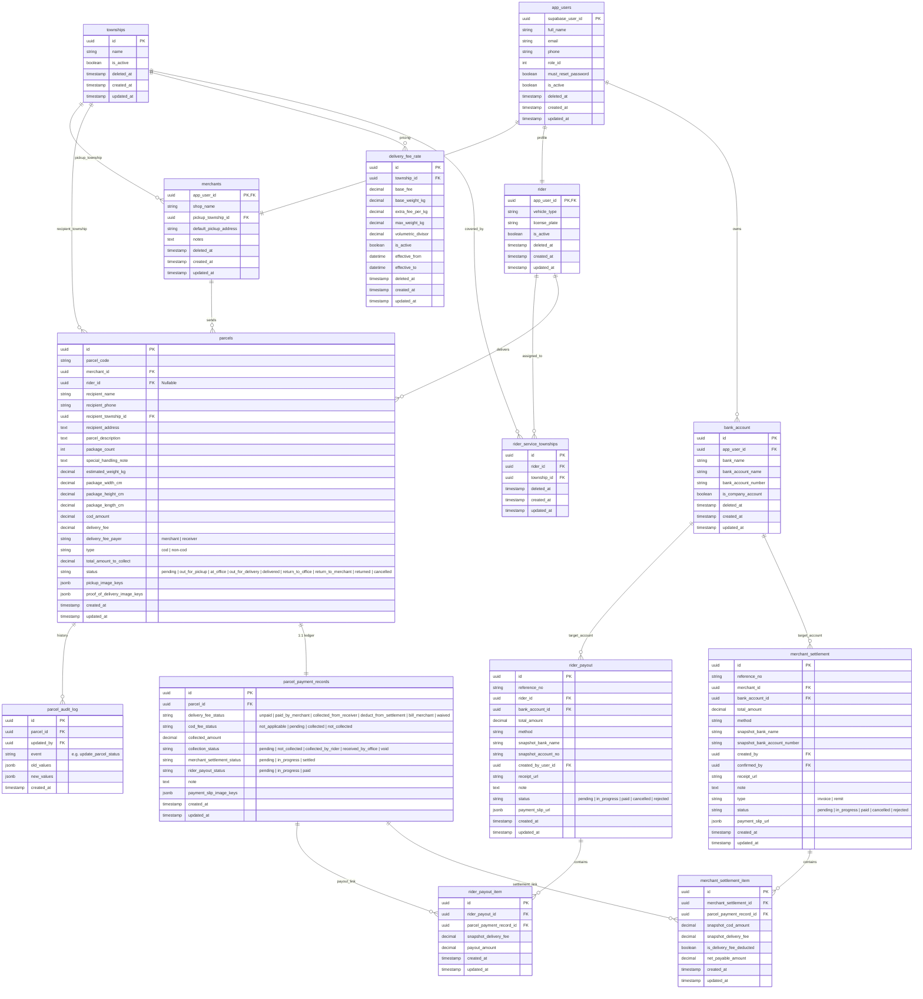

# Parcel Flow Database Diagram (v3)

Updated decisions:

- `app_users` stores shared human/account fields
- `merchants` stores business profile fields only
- `riders` stores rider operational fields only
- superadmin create user, merchant and rider records will auto create. for merchant shop name, we will use app_user name as default. For rider, we will use bike as default for vehicle type. Other fields will be null.
- No more seperate create form for merchant and rider. We will use user create form to create both. When select role in user create form, it will show merchant or rider fields.

## Mermaid ER Diagram

